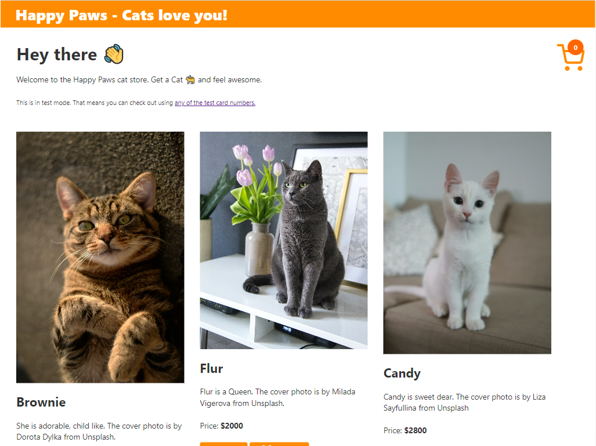

<h1 align="center">
  Happy Paws Pet Store
</h1>

`Happy Paws` Cat store is a Jamstack application to showcase the integration between Netlify Functions, Stripe and Gatsby. It does a test checkout and the app is only for the learning/demo purposes.

  

Build Status: 

# How to set up
A Step by step guide to build an application like catstore is on the way..
